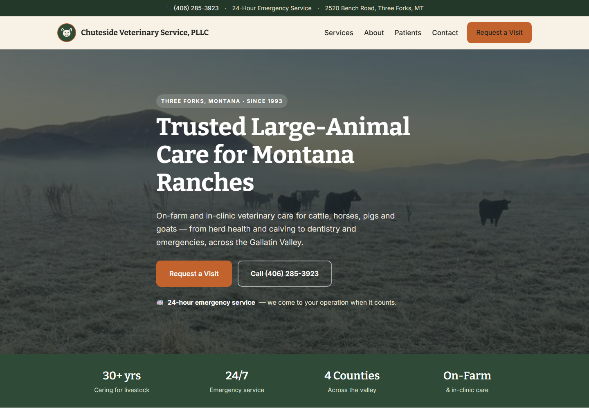

# Chuteside Veterinary Service, PLLC — WordPress Theme

A rugged, professional one-page WordPress theme for a large-animal veterinary practice in Three Forks, Montana. On-farm and in-clinic care for cattle, horses, pigs, and goats.



## Features

- **One-page homepage** — hero, trust stats, services, about, patients gallery, seasonal promo, and an appointment request section with an embedded map
- **Appointment form** with client-side confirmation (no backend needed for local use)
- **Services** rendered from a single editable array
- **Real business details** — phone, address, hours, and service area wired through the templates
- **Local SEO** — `VeterinaryCare` JSON-LD schema on the homepage
- **WordPress-native** — `wp_nav_menu`, custom logo support, `title-tag`, translation-ready (`chuteside` text domain)
- **Responsive** with a sticky header and mobile nav
- Earthy green / cream / sunset-rust palette, Bitter + Inter type
- Lightweight vanilla JS, no frameworks

## Structure

```
Chuteside/
├── functions.php     # setup, asset enqueue, schema
├── header.php        # topbar, branding, primary nav
├── footer.php        # contact, hours, services, service area
├── front-page.php    # homepage sections
├── index.php         # blog/archive fallback
├── page.php          # static page template
├── style.css         # theme header + all styles
└── assets/
    ├── js/chuteside.js
    └── images/        # logo + site photos
```

## Install

Copy the `Chuteside` folder into `wp-content/themes/`, then activate it under Appearance → Themes. Set the front page to a static page (Settings → Reading) so `front-page.php` is used, and set your Site Title under Settings → General.

## Customizing

- **Services** — edit the `$services` array in `front-page.php`.
- **Photos** — replace the files in `assets/images/` (`hero-pasture`, `clinic-sunset`, `patient-*`).
- **Contact details** — phone/address/hours live in `header.php`, `footer.php`, and the appointment section of `front-page.php`.
- **Schema** — update `chuteside_schema()` in `functions.php` if the address or hours change.

## License

GPL v2 or later.
